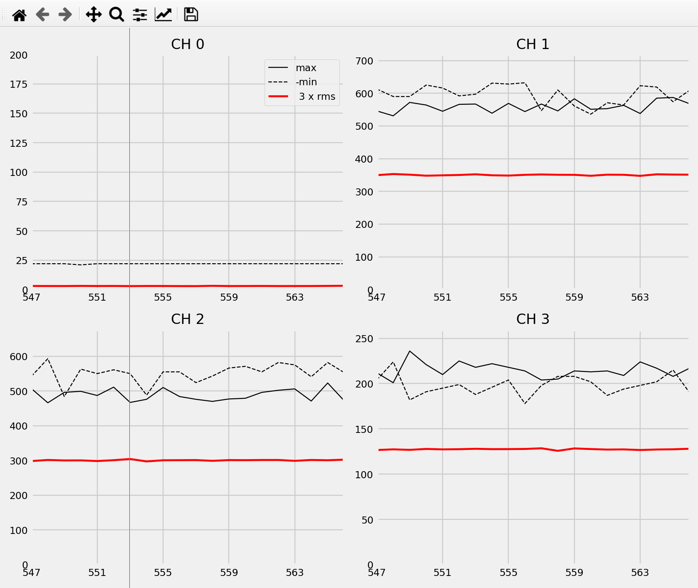
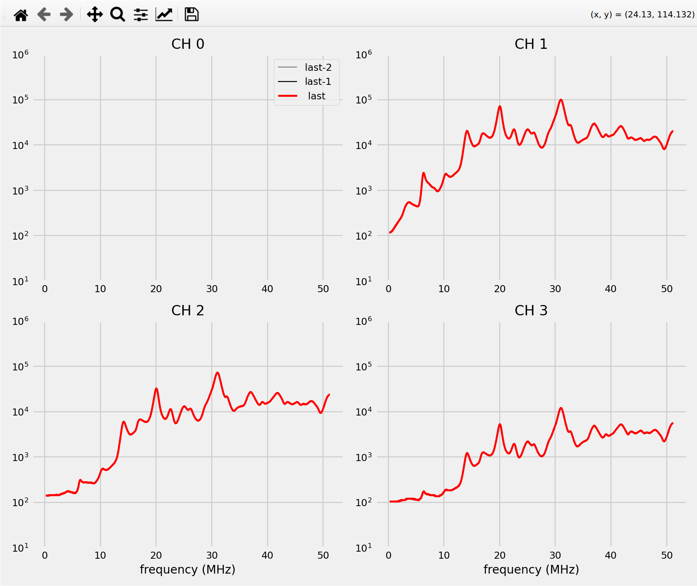

# Live mode instructions

Live mode allows one to see the data coming in a quasi real-time.

There are two modes: the ADC mode and the spectra mode. The ADC mode requests ADC statistics packets and plots min/max/rms as a function of time. It has the advantage that the cadence is higher, approximately one per second on the slow SSL interface. The rms is literally the square root of all power seen by the ADC, but any small individual line will get lost in it.  The spectra mode shows the 4 auto-correlation spectra, but the cadence is neccessarilly limited by the pipe width with the maximum around one per 5 seconds.


To run them, one needs to two run two programs
 * `live` test thrugh `cli_driver.py` that collects the data and stores it
 * `display_live.py` which reads the data as it gets produced and displays it.


 # ADC mode


Run:

```
python test/cli_driver.py -r live -b DCB
```

and then, in a separate terminal, run 

```
python test/display_live.py
```

White some luck, you should see something like and updating live:



It shows the (negative) min/max in black -- they sould be less than 5000 ideally or you a driving close to dynamic range of ADCs.
Red is the direct measure of the power seen by the spectrometer.

Options that affect results to `display_live.py`:
 * `-t` to forego graphical plotting and instead show numbers on terminal
* `-n 10` to use 10 rather than 20 points

Options that affects results to `cli_driver`. Test options are specified under -o are comma separated:
 * `gain` specifies channel gains as a 4 character string (`gain=HHHH` for all channels in high gain)
 * `sleep` how much to wait between ADC stat request in seconds, 1 is default, use 2 if it seems to have issues

Ie, one can run

```
python test/cli_driver.py -r live -b DCB -o "gain=HHHH, sleep=2"
```


## Spectra mode


Run (note `mode=spectra` option)

```
python test/cli_driver.py -r live -b DCB -o "mode=spectra"
```

and then, in a separate terminal, run  (display_live automatically works out whether we are doing adc or spectra)

```
python test/display_live.py
```

White some luck, you should see something like and updating live:


It shows 4 spectra. The latest spectrum is in red, the last by one and one behind it are in think black, and dashed think black (can't see them above, since red if over them).

Options that affect results to `display_live.py`:
 * `-t` to forego graphical plotting and instead show numbers on terminal. Here we show mean power 4-6 MHz (for e.g setting AWG to 5 MHz)

Options that affects results to `cli_driver`. Test options are specified under -o are comma separated:
 * `gain` specifies channel gains as a 4 character string (`gain=HHHH` for all channels in high gain)
 * `Navg2` specifies stage 2 averager. 3 = ~5 seconds , 4= ~10 seconds
 * `slicer` : specifies digital gain (moves power up and down -- make sure it fits 0-1e9)

